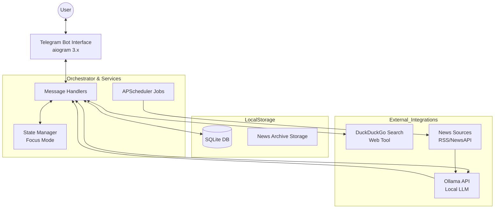

# TECHNICAL ARCHITECTURE: PERSONAL NEWS AGENT BOT

## 1. Overview
Hệ thống được thiết kế theo mô hình **Event-Driven Agentic Architecture**, nơi Telegram Bot đóng vai trò là giao diện người dùng (Interface), và một bộ điều phối (Orchestrator) kết nối các dịch vụ AI local, tìm kiếm web, và lưu trữ dữ liệu.

Ưu tiên hàng đầu là **Privacy-first** (xử lý local qua Ollama) và **Real-time, Full-content Retrieval** (lấy toàn văn nội dung bài báo để AI xử lý chính xác nhất).

---

## 2. System Architecture Diagram



---

## 3. Component Deep-dive

### 3.1. Telegram Interface (`src.bot`)
- **Framework:** `aiogram 3.x`.
- **Function:** Tiếp nhận lệnh, quản lý menu nút bấm (Inline Keyboard), và hiển thị kết quả tóm tắt.
- **FSM (Finite State Machine):** Sử dụng để quản lý **Focus Mode**. Khi người dùng chọn "Hỏi thêm về tin X", bot sẽ lưu `article_id` vào state của user để các câu hỏi tiếp theo tự động lấy ngữ cảnh từ tin đó.

### 3.2. AI Orchestration (`src.ai`)
- **Backend:** Ollama (Local API).
- **Prompt Engineering:**
    - **Summarizer:** Tóm tắt tin thô thành 2 câu súc tích.
    - **Query Designer:** Chuyển đổi ngôn ngữ tự nhiên của người dùng thành từ khóa tìm kiếm tối ưu.
    - **Synthesizer:** Kết hợp nội dung tin gốc + kết quả web search + câu hỏi người dùng để tạo câu trả lời cuối cùng.

### 3.3. News & Search Engine (`src.news`)
- **Aggregator:** Thu thập tin từ RSS feeds hoặc News API.
- **Filter Engine:** 
    - **Exclusion (Block):** Hard-filter dựa trên từ khóa.
    - **Inclusion (Follow):** Ưu tiên xếp hạng (Ranking) tin tức để đưa vào bản tin hàng ngày.
- **Web Search & Scrape:** Sử dụng `duckduckgo-search` để tìm kiếm và **cào toàn bộ văn bản thô (Full-content)** của các trang liên quan để trả lời chi tiết.

### 3.4. Database Schema (`src.database`)
- **Table `users`:** Lưu `user_id`, `chat_id`, và cài đặt cá nhân (JSON).
- **Table `news_articles`:** Lưu trữ metadata của các tin tức đã từng được gửi (Title, URL, Summary, Content) để phục vụ tra cứu lại từ bản tin cũ.
- **Table `preferences`:** Danh sách từ khóa `Follow` và `Block`.

---

## 4. Operational Flows

### A. News Briefing Flow (SYS1)
1. **Trigger:** APScheduler kích hoạt dựa trên danh sách các khung giờ cấu hình (vd: [08:00, 15:00, 22:00]).
2. **Collect:** Quét tin từ nguồn -> Lọc qua `Inclusions/Exclusions`.
3. **AI Task:** Gửi 5 tin hàng đầu sang Ollama để tóm tắt.
4. **Archive:** Lưu metadata của 5 tin này vào bảng `news_articles` kèm `article_id`.
5. **Push:** Bot gửi tin nhắn kèm các nút `callback_data="deep_dive:[article_id]"`.

### B. Contextual Deep-dive Flow (USER2)
1. **Trigger:** Callback query "Hỏi thêm về tin số X" (kể cả từ bản tin cũ).
2. **Context Retrieval:** Bot truy xuất nội dung tin X từ bảng `news_articles` thông qua `article_id`.
3. **Search:** Tìm kiếm web bổ trợ: `[News X Title] + [User Question]`.
4. **LLM Synthesis:** Ollama nhận: *User Question* + *Original News* + *Full-content Search Articles*.
5. **Response:** Trả lời chi tiết dựa trên câu hỏi của người dùng và đính kèm link nguồn.

---

## 5. Implementation Rules
1. **Async Everywhere:** Tất cả các cuộc gọi I/O (Ollama API, DB, Search, Telegram) phải dùng `async/await`.
2. **Cross-platform Paths:** Sử dụng `pathlib` cho mọi thao tác file để chạy tốt trên cả Windows và Linux.
3. **Error Resilience:** 
    - Nếu Ollama chết: Trả về link gốc và thông báo lỗi nhẹ nhàng.
    - Nếu Search lỗi: Trả lời dựa trên thông tin sẵn có trong tin tức gốc.
4. **Environment:** Biến môi trường `.env` quản lý Bot Token, Ollama URL, và Model Name.

---

## 6. Technical Specification: Protocols

Để đảm bảo tính **Strict Typing** và khả năng mở rộng, hệ thống sử dụng các Python Protocol (Structural Subtyping):

### 6.1. `AIServiceProtocol`
```python
class AIServiceProtocol(Protocol):
    async def summarize_news(self, raw_content: str) -> str:
        """Tóm tắt nội dung tin tức thành tối đa 2 câu."""
        ...

    async def extract_search_queries(self, user_prompt: str) -> list[str]:
        """Trích xuất từ khóa tìm kiếm từ yêu cầu người dùng."""
        ...

    async def synthesize_response(self, articles: list[NewsDTO], question: str) -> str:
        """Tổng hợp câu trả lời dựa trên tập hợp dữ liệu toàn văn và câu hỏi của người dùng."""
        ...
```

### 6.2. `NewsRepositoryProtocol`
```python
class NewsRepositoryProtocol(Protocol):
    async def fetch_from_feeds(self, feeds: list[str]) -> list[NewsDTO]:
        """Quét tin từ các nguồn RSS/NewsAPI."""
        ...

    async def search_web(self, query: str, limit: int = 5) -> list[NewsDTO]:
        """Tìm kiếm và cào văn bản toàn phần của các kết quả tìm thấy."""
        ...
```

### 6.3. `StorageProtocol`
```python
class StorageProtocol(Protocol):
    async def upsert_user_config(self, user_id: int, config: UserConfigDTO) -> None:
        """Lưu hoặc cập nhật cấu hình người dùng."""
        ...

    async def archive_news_items(self, items: list[NewsDTO]) -> list[str]:
        """Lưu trữ tin tức vào Archive và trả về danh sách article_id."""
        ...

    async def get_article_by_id(self, article_id: str) -> NewsDTO | None:
        """Truy xuất tin tức lịch sử từ Archive."""
        ...
    async def get_user_config(serf, user_id: int) -> UserConfigDTO:
        """Get user config for UI display"""

```

### 6.4. `MessengerProtocol`
Đảm nhiệm việc giao tiếp với người dùng cuối (UI Layer).
```python
class MessengerProtocol(Protocol):
    async def send_briefing(self, chat_id: int, news_items: list[NewsDTO]) -> None:
        """Gửi bản tin tổng hợp kèm các nút bấm điều hướng."""
        ...

    async def send_deep_dive_response(self, chat_id: int, text: str, sources: list[str]) -> None:
        """Gửi câu trả lời chi tiết cho yêu cầu deep-dive, kèm nguồn tham chiếu."""
        ...

    async def notify_system_event(self, chat_id: int, message: str) -> None:
        """Gửi các thông báo hệ thống (xác nhận cấu hình, lỗi)."""
        ...
```

### 6.5. `BriefingServiceProtocol`
Đóng vai trò Orchestrator, điều phối luồng nghiệp vụ giữa các module.
```python
class BriefingServiceProtocol(Protocol):
    async def run_scheduled_briefing(self, chat_id: int) -> None:
        """Thực thi toàn bộ quy trình từ quét tin đến gửi bản tin tại một khung giờ cụ thể."""
        ...

    async def run_deep_dive(self, chat_id: int, article_id: str, question: str) -> None:
        """Thực thi luồng tìm kiếm bổ trợ và trả lời chuyên sâu."""
        ...
```

### 6.6. `FormatterProtocol`
Chuyên biệt hóa việc trình bày dữ liệu theo định dạng của Messenger (Markdown/HTML).
```python
class FormatterProtocol(Protocol):
    def format_briefing(self, news_items: list[NewsDTO]) -> str:
        """Chuyển đổi danh sách tin thành nội dung tin nhắn Telegram."""
        ...

    def format_deep_dive(self, answer: str, sources: list[str]) -> str:
        """Định dạng câu trả lời AI kèm link nguồn minh bạch."""
        ...
```

---

## 7. Data Management & Retention

### 7.1. News Archiving Policy
- **Persistence:** Metadata của mỗi bản tin theo lịch trình được lưu trữ vào SQLite để đảm bảo các nút bấm trên tin nhắn cũ vẫn hoạt động.
- **Data Pruning (TTL):** Hệ thống áp dụng chính sách lưu trữ **Rolling 30-day Window**.
- **Cleanup Job:** `APScheduler` sẽ thực hiện lệnh `DELETE` định kỳ hàng tuần cho các bản ghi có `created_at` cũ hơn 30 ngày để tối ưu dung lượng Disk.

### 7.2. Session & Context Handling
- **Short-term Memory:** Lịch sử hội thoại trong Focus Mode chỉ được giữ trong bộ nhớ đệm (RAM/FSM) của phiên làm việc.
- **Privacy:** Tuyệt đối không lưu vĩnh viễn nội dung câu hỏi/câu trả lời chi tiết của người dùng vào Database, trừ khi người dùng yêu cầu đánh dấu "Yêu thích".

---

## 8. Data Transfer Objects (DTOs)

```python
@dataclass(frozen=True)
class NewsDTO:
    article_id: str          # Hash của URL để định danh duy nhất
    title: str
    url: str
    source: str              # Tên nguồn (RSS name hoặc Domain)
    raw_content: str = ""    # Nội dung đầy đủ để AI tóm tắt
    summary: str = ""        # Kết quả sau khi AI tóm tắt
    published_at: str = ""   # Thời gian xuất bản tin

@dataclass(frozen=True)
class UserConfigDTO:
    user_id: int
    chat_id: int
    follow_keywords: list[str]
    block_keywords: list[str]
    briefing_times: list[str] = field(default_factory=lambda: ["08:00"])
```
