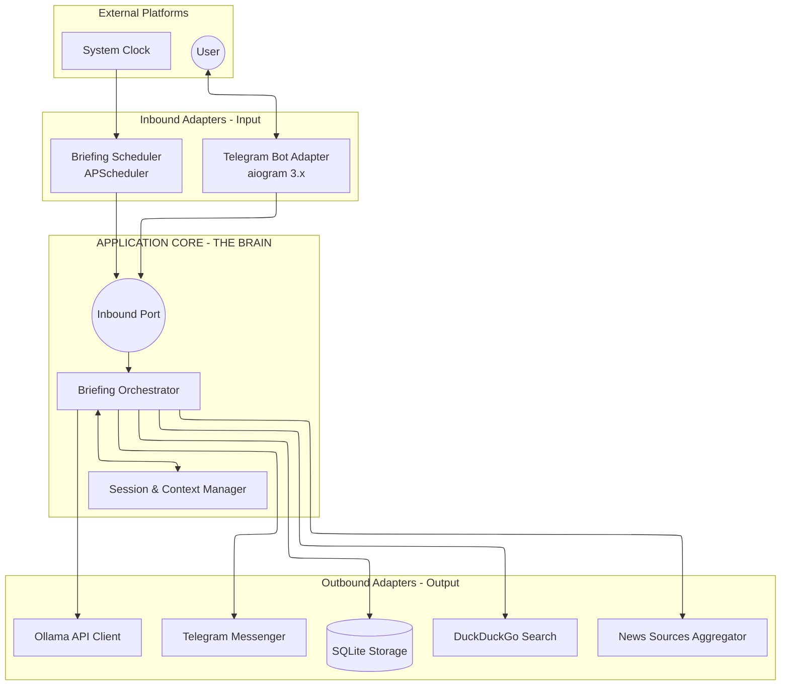

# TECHNICAL ARCHITECTURE: PERSONAL NEWS AGENT BOT

## 1. Overview
Hệ thống được xây dựng theo kiến trúc **Hexagonal Architecture (Ports & Adapters)**. Mục tiêu cốt lõi là tách biệt hoàn toàn logic nghiệp vụ (Application Core) khỏi các chi tiết hạ tầng và nền tảng (Infrastructure/Platform).

- **Core Logic (The Brain):** Hoàn toàn độc lập, không phụ thuộc vào UI (Telegram, Web) hay dịch vụ bên ngoài (Ollama, SQLite).
- **Adapters (Plug & Play):** Các module giao tiếp với thế giới bên ngoài. Việc thay đổi từ Telegram sang Discord, hay từ Ollama sang GPT-4 chỉ đòi hỏi thay đổi Adapter tương ứng mà không ảnh hưởng đến Core.
- **Privacy & Quality:** Xử lý local ưu tiên qua Ollama và lấy toàn văn bài báo (Full-content Retrieval) để đảm bảo độ chính xác cao nhất.

---

## 2. System Architecture Diagram



---

## 3. Component Deep-dive

### 3.1. Messaging Adapters (`src.bot`)
- **Role:** Inbound & Outbound Adapter.
- **Inbound:** Tiếp nhận Update từ Telegram, chuyển đổi thành các Command (DTO) để gửi vào Core.
- **Outbound:** Triển khai `MessengerProtocol` để định dạng dữ liệu từ Core thành tin nhắn Telegram (Markdown, Buttons).
- **Lưu ý:** Không chứa logic nghiệp vụ hay quản lý trạng thái hội thoại.

### 3.2. Application Core (`src.services` & `src.ai`)
- **Orchestrator:** Điều phối luồng dữ liệu giữa AI, Search và Storage.
- **Context Manager:** Quản lý **Focus Mode** và trạng thái người dùng (Session). 
- **AI Logic:** Định nghĩa các Prompt và quy trình xử lý AI (Summarize, Synthesis). Việc gọi API thật sẽ thông qua `AIServiceProtocol`.

### 3.3. External Data Adapters (`src.news`)
- **News Aggregator:** Điểm cắm (Adapter) để lấy tin từ RSS/NewsAPI.
- **Web Research:** Adapter dùng `duckduckgo-search` để tra cứu thông tin bổ trợ.
- **Scraper:** Chuyển đổi nội dung HTML từ web thành text thô cho Core xử lý.

### 3.4. Persistence Layer (`src.database`)
- **Outbound Adapter:** Triển khai `StorageProtocol`.
- **Data:** Lưu trữ Metadata tin tức, cấu hình User và **Trạng thái Session** (thay thế cho FSM của Bot).

---

## 4. Operational Flows

### A. News Briefing Flow (SYS1)
1. **Trigger (Inbound Adapter):** Scheduler đến giờ hẹn gọi Core.
2. **Execution (Core):** `BriefingService` thực hiện quét tin qua `NewsPort`.
3. **Processing (Core):** Gọi `AIPort` để tóm tắt 5 tin tiêu biểu.
4. **Persistence (Outbound Adapter):** Lưu metadata vào DB.
5. **Delivery (Outbound Adapter):** Gọi `MessengerPort` để đẩy tin nhắn tới User.

### B. Contextual Deep-dive Flow (USER2)
1. **Trigger (Inbound Adapter):** User bấm nút -> Telegram Adapter gọi hàm `run_deep_dive` của Core.
2. **Context Retrieval (Core):** Truy xuất Article & Session từ Port Storage.
3. **Research (Core):** Phối hợp Search Port và AI Port để tạo câu trả lời.
4. **Response (Outbound Adapter):** Trả kết quả qua Messenger Port.

---

## 5. Implementation Rules
1. **Async Everywhere:** Tất cả các cuộc gọi I/O (Ollama API, DB, Search, Telegram) phải dùng `async/await`.
2. **Cross-platform Paths:** Sử dụng `pathlib` cho mọi thao tác file để chạy tốt trên cả Windows và Linux.
3. **Error Resilience:** 
    - Nếu Ollama chết: Trả về link gốc và thông báo lỗi nhẹ nhàng qua Messenger Port.
    - Nếu Search lỗi: Trả lời dựa trên thông tin sẵn có trong tin tức gốc.
4. **Environment:** Biến môi trường `.env` quản lý Bot Token, Ollama URL, và Model Name.
5. **Dependency Inversion (Hexagonal Rule):** 
    - **Core** chỉ làm việc với **Protocols (Ports)** và **DTOs**. 
    - Tuyệt đối không import các thư viện bên ngoài (aiogram, ollama SDK, v.v.) vào tầng Core.
    - Logic format tin nhắn (HTML/Markdown) thuộc về Adapter, Core chỉ cung cấp dữ liệu thô.

---

## 6. Technical Specification: Protocols

Để đảm bảo tính **Strict Typing** và khả năng "Plug & Play", hệ thống sử dụng các Python Protocol:

### 6.0. `AgentControllerProtocol` (Inbound Port)
Đây là cổng vào duy nhất của hệ thống, tiếp nhận mọi tín hiệu từ các môi trường bên ngoài.
```python
class AgentControllerProtocol(Protocol):
    """
    Primary Port: Cổng điều phối tập trung. Chịu trách nhiệm dịch các tín hiệu từ 
    Inbound Adapters (Telegram, Web, Scheduler) thành các Use Cases trong Core.
    """
    async def handle_user_command(self, recipient_id: str, text: str) -> None:
        """
        Tiếp nhận và xử lý các câu lệnh/tin nhắn văn bản từ người dùng.
        
        Args:
            recipient_id: Định danh duy nhất cho điểm nhận (Telegram Chat ID, Session UUID, etc.)
            text: Nội dung văn bản thô từ người dùng.
        """
        ...

    async def handle_interaction(self, recipient_id: str, action_id: str, payload: dict) -> None:
        """
        Tiếp nhận các tương tác có cấu trúc (callback buttons, menu clicks).
        
        Args:
            recipient_id: Định danh duy nhất cho điểm nhận.
            action_id: Mã định danh hành động (ví dụ: 'deep_dive', 'config_update').
            payload: Dữ liệu đính kèm hành động dưới dạng dictionary.
        """
        ...
```

### 6.1. `AIServiceProtocol`
```python
class AIServiceProtocol(Protocol):
    async def summarize_news(self, raw_content: str) -> str:
        """Tóm tắt nội dung tin tức thành tối đa 2 câu."""
        ...

    async def extract_search_queries(self, user_prompt: str) -> list[str]:
        """Trích xuất từ khóa tìm kiếm từ yêu cầu người dùng."""
        ...

    async def synthesize_response(self, articles: list[NewsDTO], question: str) -> str:
        """Tổng hợp câu trả lời dựa trên dữ liệu toàn văn và câu hỏi của người dùng."""
        ...
```

### 6.2. `NewsRepositoryProtocol`
```python
class NewsRepositoryProtocol(Protocol):
    async def fetch_from_feeds(self, feeds: list[str]) -> list[NewsDTO]:
        """Quét tin từ các nguồn RSS/NewsAPI."""
        ...

    async def search_web(self, query: str, limit: int = 5) -> list[NewsDTO]:
        """Tìm kiếm và cào văn bản toàn phần của các kết quả tìm thấy."""
        ...
```

### 6.3. `StorageProtocol` (Outbound Port)
Cung cấp giải pháp lưu trữ bền vững cho metadata, cấu hình và trạng thái hội thoại.
```python
class StorageProtocol(Protocol):
    async def upsert_user_config(self, user_id: str, config: UserConfigDTO) -> None:
        """Lưu hoặc cập nhật cấu hình người dùng."""
        ...

    async def get_user_config(self, user_id: str) -> UserConfigDTO | None:
        """Truy xuất cấu hình người dùng."""
        ...

    async def archive_news_items(self, items: list[NewsDTO]) -> list[str]:
        """Lưu trữ tin tức vào Archive và trả về danh sách article_id."""
        ...

    async def get_article_by_id(self, article_id: str) -> NewsDTO | None:
        """Truy xuất tin tức lịch sử từ Archive."""
        ...

    async def save_session_context(self, recipient_id: str, context: dict) -> None:
        """Lưu trữ trạng thái hội thoại (Focus Mode, Article ID hiện tại)."""
        ...

    async def get_session_context(self, recipient_id: str) -> dict | None:
        """Lấy lại trạng thái hội thoại của người dùng."""
        ...
```

### 6.4. `MessengerProtocol` (Outbound Port)
Đảm nhiệm việc gửi phản hồi tới người dùng. Interface này KHÔNG bao gồm logic format chuỗi.
```python
class MessengerProtocol(Protocol):
    async def send_briefing(self, recipient_id: str, news_items: list[NewsDTO]) -> None:
        """Gửi bản tin tổng hợp. Việc hiển thị (Markdown/HTML/Buttons) do Adapter quyết định."""
        ...

    async def send_deep_dive_response(self, recipient_id: str, answer: str, sources: list[str]) -> None:
        """Gửi câu trả lời chi tiết kèm nguồn tham chiếu."""
        ...

    async def notify_event(self, recipient_id: str, message_key: str, **kwargs) -> None:
        """Gửi thông báo hệ thống (dùng i18n keys)."""
        ...
```

### 6.5. `BriefingServiceProtocol` (Application Port)
Đóng vai trò Orchestrator trong Core.
```python
class BriefingServiceProtocol(Protocol):
    async def run_scheduled_briefing(self, recipient_id: str) -> None:
        """Thực thi quy trình từ quét tin đến đẩy bản tin tại một khung giờ cụ thể."""
        ...

    async def run_deep_dive(self, recipient_id: str, article_id: str, question: str) -> None:
        """Thực thi luồng tìm kiếm bổ trợ và tóm tắt chuyên sâu dựa trên ngữ cảnh."""
        ...
```

---

## 7. Data Management & Retention

### 7.1. News Archiving Policy
- **Persistence:** Metadata của mỗi bản tin được lưu vào SQLite để đảm bảo các nút bấm cũ vẫn hoạt động.
- **Data Pruning (TTL):** Hệ thống áp dụng chính sách **Rolling 30-day Window**.

### 7.2. Session & Context Handling
- **Platform Independence:** Trạng thái hội thoại (Focus Mode) được lưu tại Persistence Layer (qua `StorageProtocol`). 
- **Resilience:** Hệ thống có khả năng khôi phục ngữ cảnh ngay cả sau khi restart service hoặc chuyển đổi platform (Telegram <-> Web).

---

## 8. Data Transfer Objects (DTOs)

```python
@dataclass(frozen=True)
class NewsDTO:
    article_id: str          # Hash của URL để định danh duy nhất
    title: str
    url: str
    source: str              # Tên nguồn (RSS name hoặc Domain)
    raw_content: str = ""    # Nội dung đầy đủ để AI tóm tắt
    summary: str = ""        # Kết quả sau khi AI tóm tắt
    published_at: str = ""   # Thời gian xuất bản tin

@dataclass(frozen=True)
class UserConfigDTO:
    user_id: str
    recipient_id: str
    follow_keywords: list[str]
    block_keywords: list[str]
    briefing_times: list[str] = field(default_factory=list)
```
