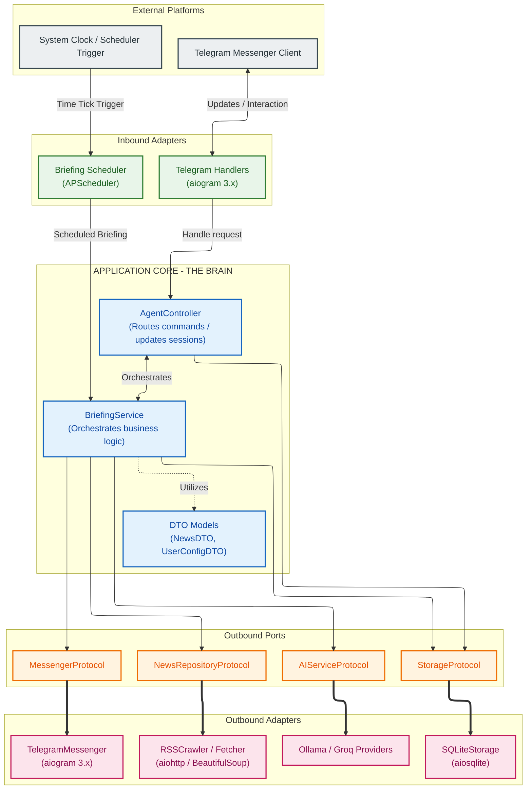

# Personal News Agent Bot 📰🤖

A production-grade, highly optimized, and self-hosted personal news aggregation and analysis bot. Designed using **Hexagonal Architecture (Ports & Adapters)**, this application fetches news articles from major Vietnamese RSS feeds, applies dynamic keyword filters, generates factual summaries, and provides contextual deep-dives via local or cloud Large Language Models (LLMs) like **Ollama** and **Groq**.

---

## 🏛️ Technical Architecture

This system strictly implements **Hexagonal Architecture (Ports & Adapters)**. The **Application Core** is completely decoupled from any specific delivery platform (Telegram), storage mechanism (SQLite), crawler (aiohttp/BeautifulSoup), or language models (Ollama/Groq SDKs). Ports (interfaces/protocols) define system boundaries, and Adapters implement them to interface with external systems.



---

## ✨ Features

- **📅 Scheduled Push Briefings (SYS1)**: Automatically aggregates news from configured RSS endpoints at customizable intervals (default: `08:00`, `20:00`), applies inclusion/exclusion filters, generates 1-2 sentence AI summaries, archives metadata, and pushes custom-styled Telegram cards.
- **🔍 Contextual Deep-Dives (USER2)**: Locks a chat thread into **Focus Mode** for a specific article. Asks clarifying questions, performs real-time parallel search inquiries across native Vietnamese portals, fetches full text, and synthesizes balanced, fact-grounded responses.
- **⚡ Ad-Hoc Direct Queries (USER3)**: Real-time internet search and summarization for custom prompts (e.g., *"Tin mới về OpenAI"*, *"Giá Bitcoin hôm nay"*), automatically optimizing natural questions into search-friendly keywords.
- **⚙️ Personalization & Preferences (USER4)**: Complete in-chat curation of interests using `/follow [keyword]` (prioritization/inclusion), `/block [keyword]` (hard exlusions), and `/list` configuration display.

---

## 🛠️ Technology Stack

- **Core**: Python 3.10+, dynamic typing, async/await I/O pipeline.
- **Package Manager**: [uv](https://github.com/astral-sh/uv) (blazing fast Python packaging).
- **Telegram Client**: `aiogram 3.x` (asynchronous Telegram API framework).
- **Scheduler**: `APScheduler` (asynchronous job trigger management).
- **Database**: `aiosqlite` (async wrapper for SQLite storage).
- **Ingestion & Fetching**: `feedparser` + `BeautifulSoup` + `aiohttp` (high-throughput parallel static content scraping).
- **AI & LLM Providers**: `Ollama AsyncClient` (local execution) and `Groq AsyncGroq` (cloud hosting).

---

## 📂 Project Structure

```text
news_agent/
├── src/
│   ├── bot/                # Inbound/Outbound Messaging Adapters (aiogram, APScheduler)
│   │   ├── scheduler.py         # Briefing schedule tick processor
│   │   ├── telegram_handlers.py # Telegram user interaction routers
│   │   ├── telegram_messenger.py# Rich formatting and Delivery engine
│   │   └── protocol.py          # Messenger abstraction
│   ├── services/           # Application Core (Domain logic orchestration)
│   │   ├── agent_controller.py  # User input routers & context trackers
│   │   ├── briefing_service.py  # Data crawler & synthesis coordinator
│   │   └── protocol.py          # Port specifications
│   ├── database/           # SQLite Persistence Layer
│   │   ├── sqlite_storage.py    # aiosqlite interface
│   │   └── protocol.py          # Storage abstraction
│   ├── news/               # Crawler, Scraper, & Web Search Engine
│   │   ├── fetchers/            # Static HTML body extractors
│   │   ├── rss_crawler.py       # feedparser ingestion & Search scraper
│   │   ├── sources.py           # VN News publishers endpoint definitions
│   │   └── protocol.py          # Crawling abstraction
│   ├── ai/                 # LLM interfaces & Providers
│   │   ├── providers/           # Concrete clients (Ollama, Groq)
│   │   ├── ai_service.py        # Prompts, formatting, and orchestrator
│   │   └── protocol.py          # AI service abstraction
│   ├── core/               # Shared settings & utilities
│   │   └── i18n.py              # Internationalization & specialized system prompts
│   └── models.py           # Immutable DTO containers (NewsDTO, UserConfigDTO)
├── data/                   # Directory housing SQLite persistence file
├── main.py                 # Application Composition Root
├── pyproject.toml          # uv package dependencies
└── .env                    # System environment configuration file
```

---

## ⚙️ Configuration Setup

### 1. Requirements & System Dependencies
Make sure you have **uv** installed on your system. If not, install it via:
```bash
curl -LsSf https://astral-sh/uv/install.sh | sh
```

### 2. Environment Configurations
Create a `.env` file in the root directory:
```ini
# --- Telegram Configurations ---
TELEGRAM_BOT_TOKEN=YOUR_TELEGRAM_BOT_TOKEN_FROM_BOTFATHER

# --- LLM Provider Selection (ollama / groq) ---
LLM_PROVIDER=ollama

# --- Ollama Configurations (if LLM_PROVIDER=ollama) ---
OLLAMA_HOST=http://localhost:11434
OLLAMA_MODEL=gemma4:E4B

# --- Groq Configurations (if LLM_PROVIDER=groq) ---
GROQ_API_KEY=YOUR_GROQ_API_KEY
GROQ_MODEL=openai/gpt-oss-120b
```

### 3. Initialize & Install
Initialize the workspace virtual environment and synchronize dependencies:
```bash
uv sync
```

---

## 🚀 Running the Bot

Start the application using `uv`:
```bash
uv run main.py
```

The system will automatically initialize the database schema at `data/news_agent.db`, activate the one-minute checking schedule trigger, and begin listening for Telegram webhook/polling updates.

---

## 💬 Command & User Guide

When interfacing with the Telegram Bot, the following workflows are supported:

- `/start`: Starts the onboarding process. First, prompts for language selection (`🇻🇳 Tiếng Việt` or `🇬🇧 English`), then requests the user's name to generate a custom configuration profile.
- `/follow [keyword]`: Flags a concept as highly interesting. The keyword is added to the user's inclusions profile. If the keyword was previously blocked, it is automatically unblocked.
- `/block [keyword]`: Adds a concept to hard exclusions. Any aggregated news article whose title or content contains the word will be filtered out. If the keyword was previously followed, it is automatically unfollowed.
- `/list`: Displays a detailed dashboard of current preferences, active schedule hours, selected language, and user metadata.
- **Interactive Buttons**:
  - `[🔍 Chi tiết tin số X]`: Locks Focus Mode onto the selected article context, prompting for detail questions.
  - `[🔚 Kết thúc chủ đề này]`: Clears Focus Mode, restoring standard interaction routing.
